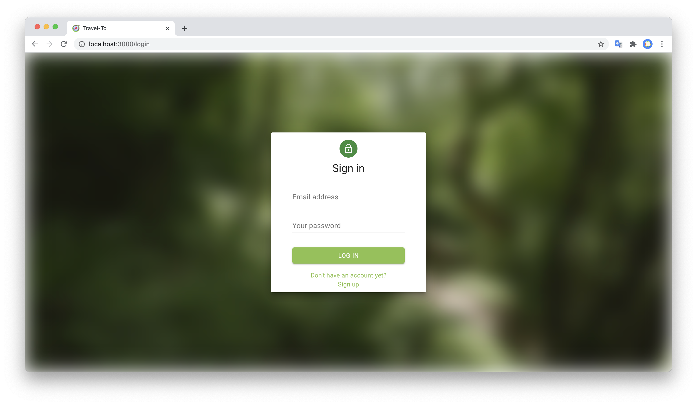
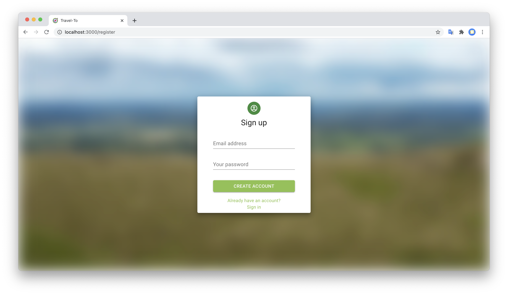
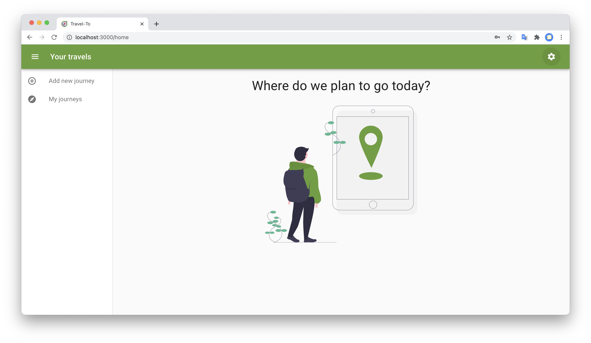
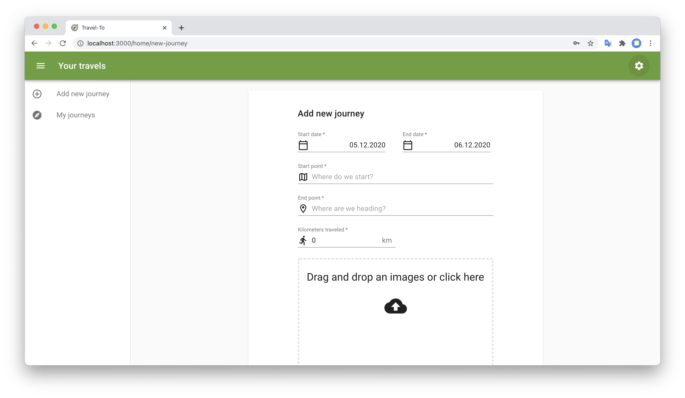
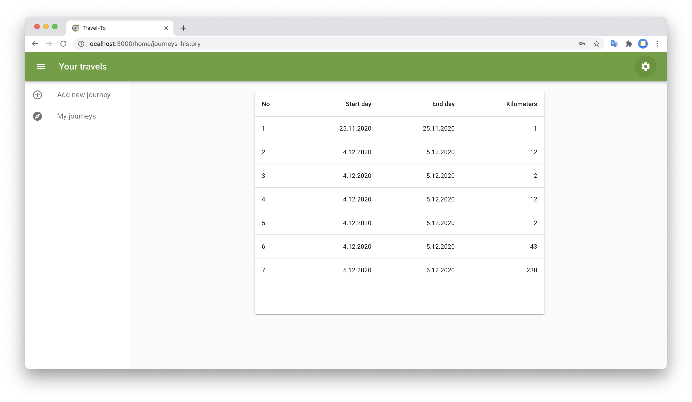
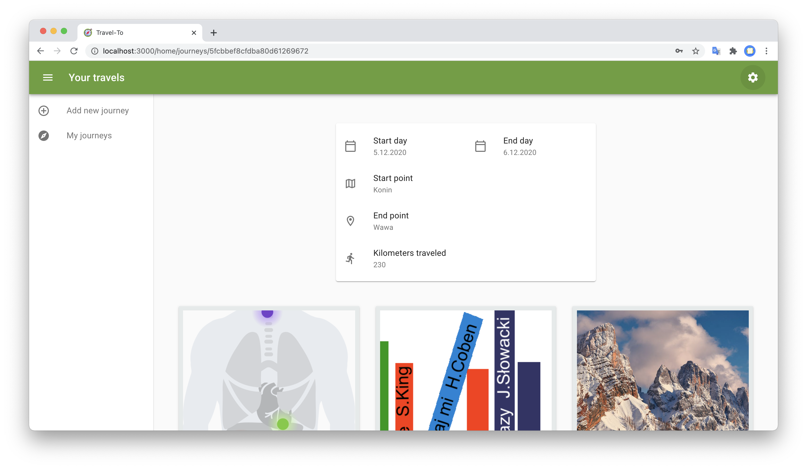
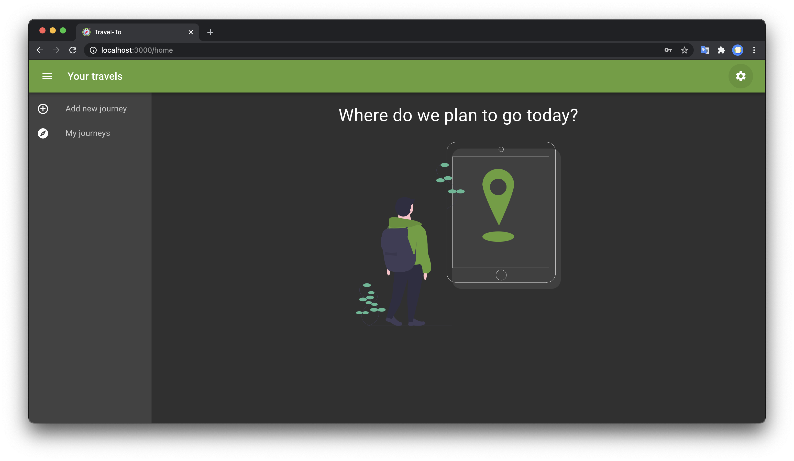
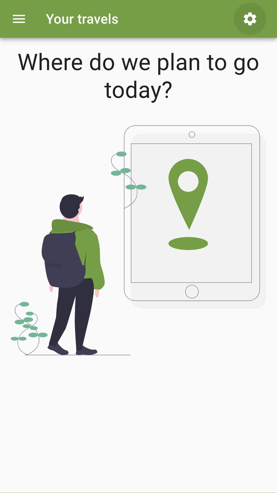
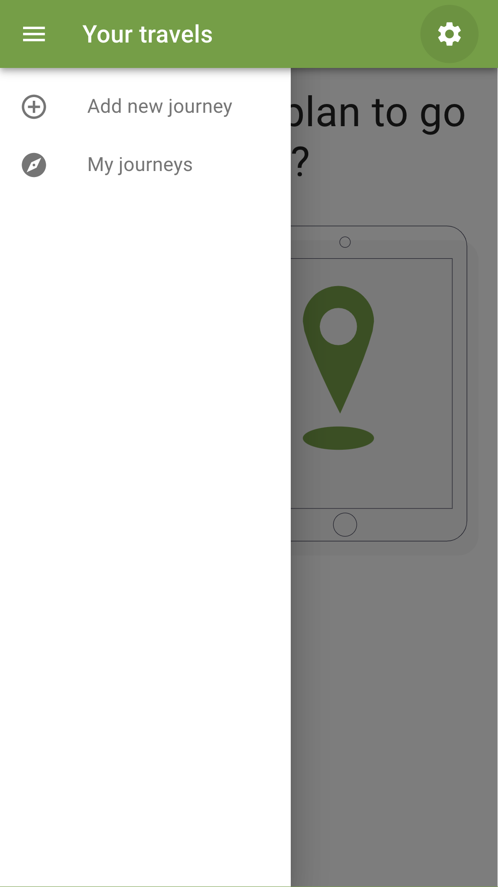

# Travel-To


Project requires configured MongoDB and Cloudinary.

```text
# random string, just for passwords hashing
AUTH_SECRET=
# host and port of web server, for local development it's localhost:3000
NEXT_PUBLIC_BACK_END_URI=
# MongoDB
DB_NAME=
MONGODB_URI=
# Cloudinary
CLOUDINARY_CLOUD_NAME=
CLOUDINARY_API_KEY=
CLOUDINARY_API_SECRET=
```











